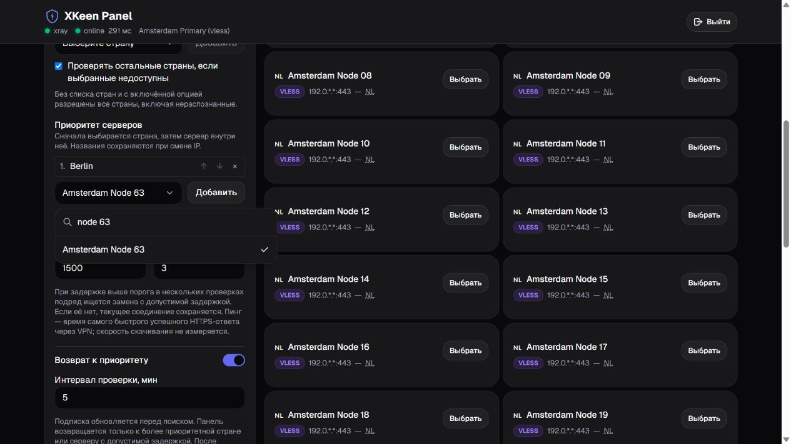
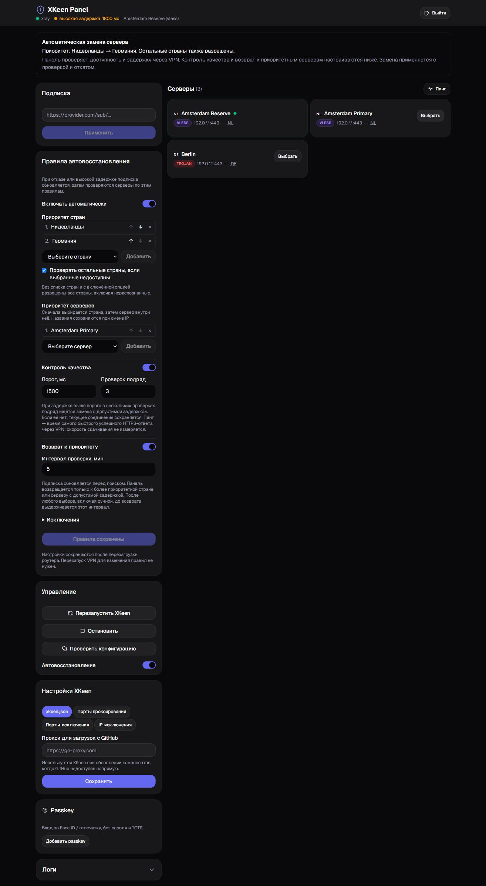

# XKeen AutoFailover

Панель для роутеров Netcraze/Keenetic с Entware и XKeen/Xray. При отказе VPN или высокой задержке обновляет подписку и выбирает проверенную замену по правилам пользователя. Когда более приоритетный сервер снова доступен с допустимой задержкой, панель возвращается к нему.

Основа — [Dearonski/xkeen-panel](https://github.com/Dearonski/xkeen-panel), исходный коммит `e0307ff36c10b640da71ad8da0ae3ca70135b200`. Это независимая доработка; проект не является официальным продуктом какого-либо VPN-сервиса.

## Установка

Нужны Entware, установленный XKeen с Xray, `curl` и уже настроенный рабочий VPN с одним proxy outbound. Сборки: ARM64, ARMv7, MIPS little-endian. Не нужно собирать проект или редактировать исходники.

По SSH на роутере:

```sh
curl -fL https://raw.githubusercontent.com/Razlo-coder/xkeen-autofailover/main/install.sh -o /tmp/xkeen-autofailover-install.sh
sh /tmp/xkeen-autofailover-install.sh
```

Установщик проверяет контрольную сумму, конфигурацию Xray и сохраняет предыдущую версию панели. Подписка, учётная запись и сохранённые в интерфейсе правила при обновлении не перезаписываются. Для старых MIPS-моделей при необходимости можно явно передать `mipsel` вторым аргументом команды `sh`.

После установки откройте `http://АДРЕС_РОУТЕРА:3000`, создайте учётную запись и подключите приложение для кодов двухфакторной авторизации. Введите свою ссылку подписки в панели.

## Настройка в интерфейсе

В карточке **«Правила автовосстановления»**:

1. Выберите страны и расположите их кнопками ↑/↓. Первая страна проверяется первой.
2. Разрешите остальные страны как запасной вариант или отключите эту опцию для строгого списка.
3. Выберите приоритетные серверы и задайте порядок внутри страны. При одинаковом названии все такие записи имеют один приоритет.
4. В разделе **«Исключения»** отметьте неподходящие серверы или введите фразы из их названий. Исключённые серверы не проверяются.
5. Включите **«Контроль качества»**: по умолчанию замена ищется после трёх проверок подряд с задержкой выше **1500 мс**. Порог и число проверок можно изменить.
6. Включите **«Возврат к приоритету»** и задайте интервал: по умолчанию **5 минут**. После ручного или автоматического выбора выдерживается такая же пауза перед возвратом.
7. Нажмите **«Сохранить правила»**. Они применяются сразу и сохраняются после перезапуска.

В выпадающих списках стран и серверов есть поиск: откройте список и введите часть названия. Регистр букв не важен; страну можно найти также по её двухбуквенному коду. Выберите результат мышью или стрелками и Enter, затем нажмите **«Добавить»**. Escape закрывает список; при следующем открытии строка поиска очищается.



При обновлении старой версии новые функции включаются с этими значениями по умолчанию. Страны, приоритеты, исключения и выключенное автовосстановление сохраняются. Обе функции можно отдельно отключить в панели.

Например, для Blanc можно выбрать Нидерланды, затем Германию, отключить остальные страны и добавить фразу `Extra Whitelist2` в исключения. Эти ограничения не включены по умолчанию для других провайдеров.



На изображении — демонстрационные серверы, без данных личной подписки.

Серверы, не разрешённые правилами, остаются видны с причиной исключения. Если страна не распознана, её можно уточнить на карточке сервера. Предпочтения и исключения по названию, а также ручная страна для однозначного названия сохраняются при смене IP в подписке.

Кнопка **«Пинг»** проверяет доступность серверов. Во время проверки можно нажать **«Выбрать»**: общий пинг прервётся, выбранный сервер пройдёт отдельную проверку и будет применён при успехе. Новый пинг можно запустить после завершения переключения.

Пинг списка и автоматический поиск проверяют до **трёх серверов одновременно**. Автоматика выбирает по заданному приоритету, даже если менее приоритетный сервер ответил раньше. Обновление подписки, выбор сервера, остановка и перезапуск отменяют текущие сетевые проверки. Обновление сначала останавливает проверку старого списка, затем загружает новый; общий пинг после этого запускается кнопкой заново.

Кнопка **«Остановить»** доступна во время проверок и поиска замены. Она выключает автовосстановление и останавливает XKeen/Xray; для последующего автоматического восстановления включите переключатель снова. Если конфигурация уже применяется, команда ждёт завершения безопасного отката, а не проверки всего списка. Ошибка сохранения настроек не препятствует остановке: панель сообщит, если выключение автоматики не удалось сохранить для перезапуска.

В шапке отображается имя подключения из фактической конфигурации Xray. Последнее подтверждённое имя сохраняется при обновлении адресов в подписке и после перезапуска панели. Если конфигурация была изменена и её нельзя сопоставить с известным сервером, панель показывает **«Текущий сервер из конфигурации»** вместо старого имени.

Пинг здесь — время самого быстрого успешного HTTPS-ответа через VPN, включая установление соединения, TLS и небольшой ответ. Ожидание другого проверочного сайта не увеличивает показанное значение. Это проверка отзывчивости соединения, а не ICMP-пинг и не измерение скорости скачивания. Высокая задержка отображается жёлтым предупреждением, даже если VPN остаётся доступен.

## Подписки и совместимость

Провайдер не привязан к коду. Поддерживаются подписки со стандартными ссылками `vless://`, `vmess://`, `trojan://`, `ss://`: обычный список или base64, включая URL-safe и варианты без padding. Импортируются основные параметры TLS/Reality и транспортов TCP, WebSocket, gRPC и XHTTP; доступность транспорта зависит от протокола и установленного Xray. Каждая новая конфигурация проверяется самим ядром. Произвольные расширения ссылок конкретного провайдера могут потребовать доработки импортера.

JSON-конфиги Xray, Clash YAML, WireGuard, Hysteria, Shadowsocks с внешними плагинами и устаревший VMess с ненулевым `alterId` не являются поддерживаемыми форматами импорта. Название сервиса само по себе не гарантирует совместимость: он должен выдавать поддерживаемые ссылки, а установленное ядро — поддерживать их параметры.

Режим подтверждённого переключения работает с **Xray и одним активным proxy outbound**. Пулы, каскадные прокси и Mihomo не входят в этот режим. Остальные возможности исходной панели сохранены для старого режима.

## Как работает восстановление

- Проверка каждую минуту, три неудачи подряд перед поиском замены. Проверяются независимые HTTPS-адреса; достаточно успеха одного. Один неработающий проверочный сайт сам по себе не вызывает переключение.
- При включённом контроле качества замена также ищется после заданного числа медленных проверок подряд. По умолчанию — три проверки выше 1500 мс; успешная быстрая проверка сбрасывает счётчик.
- Перед каждой серией выбора загружается новая подписка. Успешное обновление полностью заменяет список. Новый IP с тем же названием не наследует временное исключение старого подключения.
- Только при ошибке загрузки используется сохранённый список. Следующая серия снова обновляет подписку.
- Кандидат проверяется через короткоживущий второй Xray, без прямого обхода при отказе туннеля. Подписка и соединение тестового ядра обходят перехват основного XKeen с помощью служебной метки.
- Меняется только proxy outbound с сохранением его тега и socket options. После проверки всего каталога Xray требуется успешный перезапуск основного ядра и повторная проверка нового подключения.
- Ошибка приводит к откату исходных байтов. Незавершённое переключение восстанавливается из журнала при запуске панели.
- При включённом возврате каждые пять минут обновляется подписка и проверяются только варианты с более высоким приоритетом страны или имени. Новый сервер должен пройти проверку доступности и, если включён контроль качества, задержки до и после перезапуска. Одинаковый приоритет не вызывает переключение. При выключенном возврате исправное соединение сохраняется.
- Автоматический выбор пропускает кандидатов с задержкой выше порога. Если подходящей замены нет, текущая конфигурация сохраняется. Ручной выбор доступного медленного сервера разрешён; его качество отображается, а включённая автоматика продолжает действовать.
- Неудачные кандидаты временно пропускаются; повторные серии ограничены по частоте. Если ничего не работает, попытки продолжаются.

После установки ПК и открытая вкладка не нужны. При перезапуске VPN возможен перерыв связи. Проверка сервера не заменяет проверку всех маршрутов и сайтов на устройствах домашней сети; отдельный kill-switch проект не добавляет.

Для возврата панель должна знать имя и страну активного подключения: она сопоставляет его с подпиской и сохраняет последнее совпадение при смене IP и перезапуске панели. Сохранённое имя используется только для той же конфигурации подключения. Для неизвестной конфигурации приоритет не угадывается; восстановление при отказе или высокой задержке продолжает работать.

## Проверки и диагностика

```sh
/opt/sbin/xkeen-panel -config /opt/etc/xkeen-panel/config.yaml -preflight
/opt/sbin/xkeen-panel -config /opt/etc/xkeen-panel/config.yaml -verify-now
tail -n 50 /tmp/xkeen-panel.log
```

Отключение через переключатель автовосстановления сохраняется после перезапуска. Остановка XKeen из панели также отключает автовосстановление. Журнал хранится в `/tmp`, ограничен по размеру и исчезает после перезагрузки. Резервные копии панели находятся в `/opt/etc/xkeen-panel/backup`.

Сведения для разработчиков: [DEVELOPMENT.md](docs/DEVELOPMENT.md). Код доступа, ссылки подписок и реальные конфиги подключения в репозиторий не включаются.
